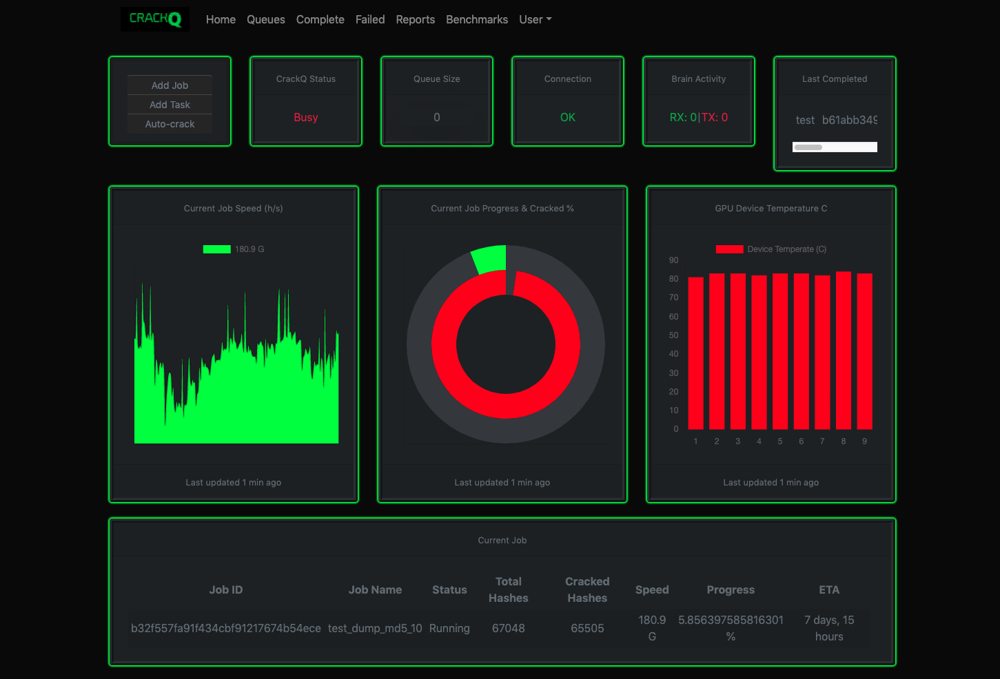

CrackQ
============

Author: Daniel Turner
@f0cker_

------------

Python 3 REST API & JS GUI for managing hashcat crack jobs in a queuing system.

Feature List
------------

* REST API
* Remote Python client or JS GUI
* Cracked passwords analysis and reporting
* Uses Hashcat API directly via libhashcat, no shell commands
* Easy installation using docker containers
* SQL, LDAP or SAML2 Authentication
* Multi-user support with privilege separation for jobs
* Job queues with pause/restore/move
* Always supports the latest Hashcat version and algorithms
* Email notifications when a hash cracks or job finishes
* Intelligent queuing, new jobs added to the queue undergo a speed/show check immediately and will instantly show previously cracked hashes from the pot file without waiting
* Automated Brain integration, Brain activates when it becomes efficient (uses above speed check)
* Detailed job stats/charts for active jobs
* Preconfigured rate-limiting
* Markov stats pre-configured
* Sample mask files included
* Hashcat benchmark visualisations

Requirements
------------

This tool has the following requirements:

* Drivers
	* OpenCL drivers - these can be installed from a repository or downloaded from the relevant vendor. Tested using Intel runtime.
	* Nvida drivers
	* AMD drivers

* Docker

* Nvidia-runtime

* Docker-compose

It is recommended to have a hefty server build with ample RAM/CPU power. However, the application has been tested on a VM with 8 cores and 4GB RAM so there should not be any issues with resources given that the server will need a good amount of resources for cracking anyway.

See the [Wiki](https://github.com/f0cker/crackq/wiki) for installation and guides.

## Official Discord Channel

Come hang out on Discord!

