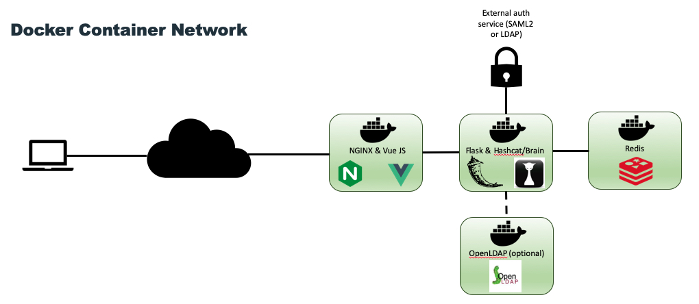

CrackQ
============

Author: Daniel Turner @ Trustwave
------------

**INTRODUCTION**
---------------

Python 3 REST API & JS GUI for managing hashcat crack jobs in a queuing system.

[]
[](https://pypi.python.org/pypi/ansicolortags/)
[](https://pypi.python.org/pypi/ansicolortags/)
[](https://www.python.org/downloads/release/python-370/)


**Install**
----------------

**Requirements**

This tool has the following requirements:

* Drivers
	* OpenCL drivers - these can be installed from a repository or downloaded from the relevant vendor. Tested using Intel runtime.
	* Nvida drivers
	* AMD drivers

* Docker

* Nvidia-runtime

* Docker-compose

It is recommended to have a hefty server build with ample RAM/CPU power. However, the application has been tested on a VM with 8 cores and 4GB RAM so there should not be any issues with resources given that the server will need a good amount of resources for cracking anyway.

See INSTALL.md for full installation guide.

---------
**Admin Guide**



To start the application use the following

```docker-compose -f docker-compose.nvidia.yml up --build```

To wipe all images/containers and start fresh build use:

```docker system prune -a```

Some admin scripts are included under /utils, these are very rough small scripts which I am adding to as the need arises.

---------
**User Guide**

To use the queue a JavaScript GUI is available by browsing to the web server root: https://crackq.xxx.com

Where crackq.xxx.com is the name used during the configuration/install process (set within crackq_nginx.conf), as outlined in *install.txt*.

Alternatively, a Python client is provided at: https://github.com/f0cker/crackq_client 

-----
**Further Notes**

The following files are used during operation for logging and state management:

* */var/crackq/logs/crackq.log*

Detailed application logs can be found in the above log file for debugging any issues.

To update an existing installation without rebuilding the images fully you can use the following commands. This will just update hashcat and the crackq backend, not the GUI, but it will give you the all the latest hashcat algorithms if you're using the bleeding edge version of hashcat in the config (default until Hashcat 6 is released):

```$docker-compose -f docker-compose.xxx.yml up --build --force-recreate```

Then drop to a shell in the crackq container:

```$sudo docker exec -it crackq /bin/bash```

and run the benchmark script to include any new algorithms:

```$cd ../ && ./benchmark.sh --force && python3 ./crackq/update_hashtypes.py```

and don't forget to update your config files if you need to.

Otherwise you can just run a complete installation from scratch. Either way, it
should'nt take any longer than an hour or so. While the project is still pre-release it is recommended to perform a full reinstallation when installing updates.

-----
**Acknowledgements**

Thanks to everyone that helped testing CrackQ:

Michal Talecki

Cauan Guimaraes

John Anderson

Jose Plascencia

@SpiderLabs

...and of course:

Hashcat!

Rich5 - PyHashcat
